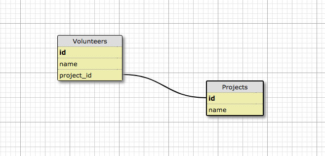
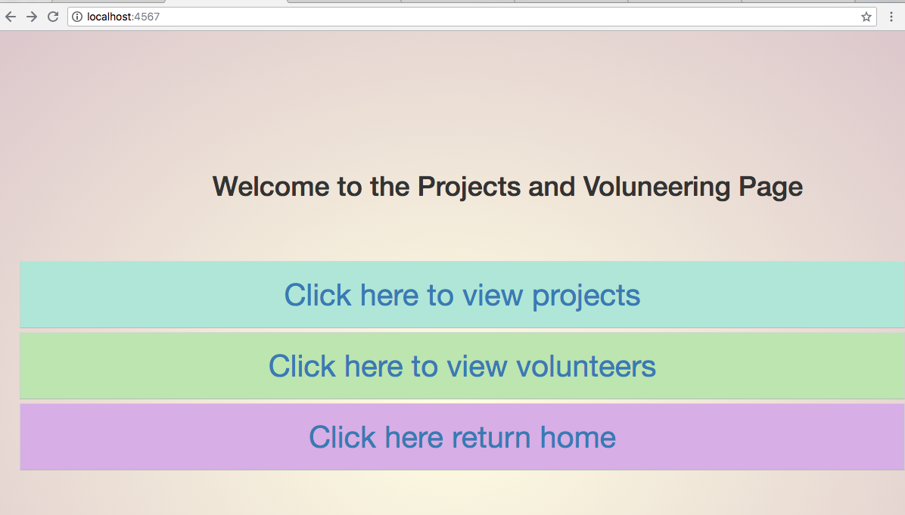
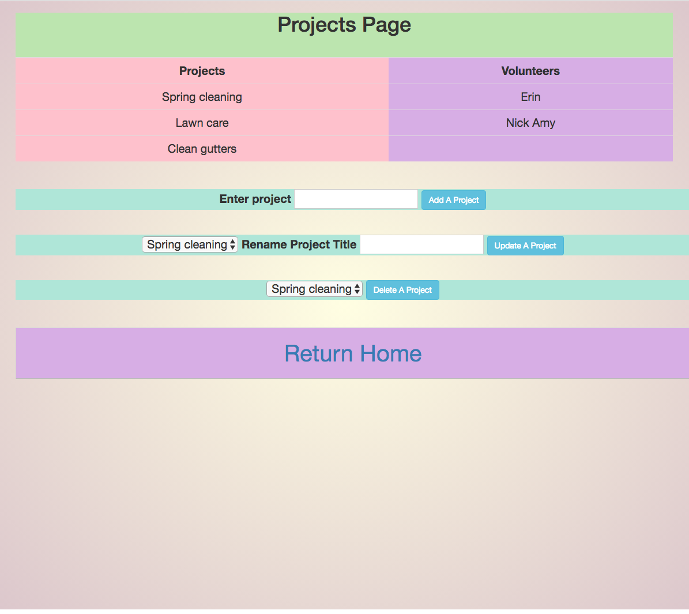
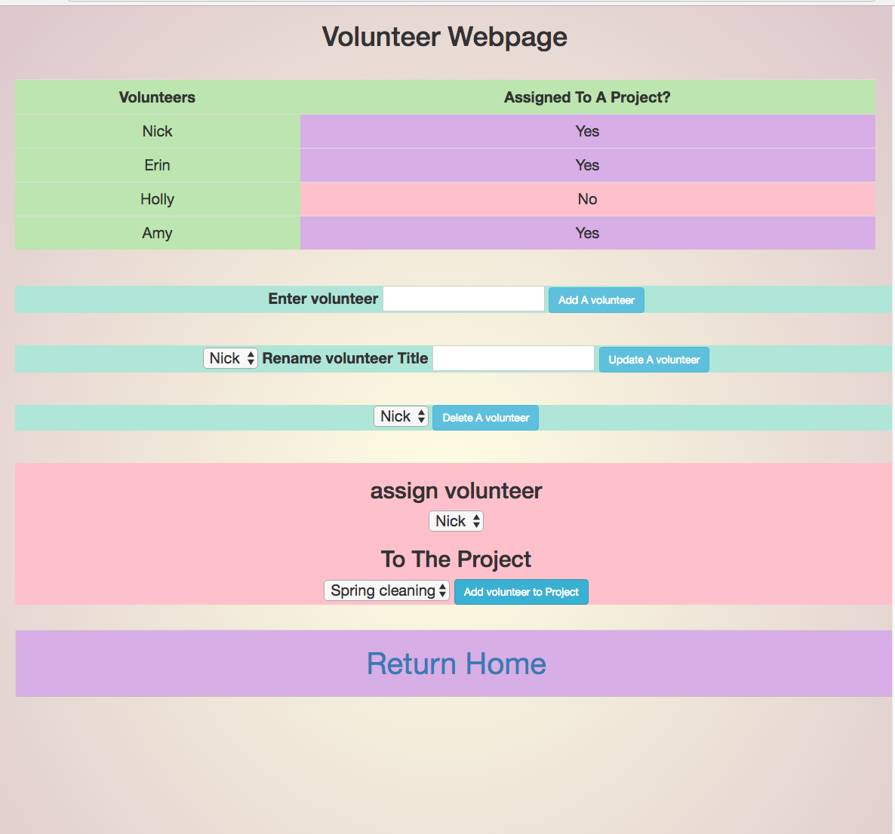

# Volunteer Tracker

###### Epicodus: Ruby Independent Project 07/13/2018
###### By Nick Brown

<hr />
## Description

 A web application that tracks both projects and their volunteers. New projects can be added, updated or deleted. Volunteers have the almost all same features as projects, (volunteers can be added, updated, deleted) with the option to assign a volunteer to a project. All the volunteers options are on the volunteer page and all the project options are on the projects webpage.

<hr />
## Design

Each volunteer will belong to only one project (one to many).

---------------------------Schema--------------------------



-------------------------------Web Homepage-------------------------------



--------------------------Projects page--------------------------



------------------------Volunteer page------------------------



<hr />

## Specifications
* _1 view volunteers.
  - _Example Input: _ "Click here to view all volunteers"
  - _Example Output: _ Volunteers: Nick Mariah
* _2 add a volunteer to the list of volunteers
  - _Example Input: _ Erin
  - _Example Output: _ Volunteers:Nick Mariah Erin
* _3 Update a listed volunteer's name
  - _Example Input: _ "Frinn" Rename volunteer Title "Erin"
  - _Example Output: _ Erin
* _3 Delete a volunteer from the list
  - _Example Input: _ Nick
  - _Example Output: _ Mariah Erin
* _3 view all projects
  - _Example Input: _ "Click here to view all projects"
  - _Example Output: _ Spring cleaning, clean out gutters
* _3 add volunteers to a project
  - _Example Input: _ "assign volunteer" Mariah "to the project" Spring cleaning
  - _Example Output: _Spring cleaning volunteers-Mariah, clean out gutters

<hr />
## Setup/Contribution Requirements

1. Clone the repo
1. database
```
createdb [volunteer_tracker]
psql [volunteer_tracker] < database_backup.sql
createdb -T [volunteer_tracker] [volunteer_tracker_test]
```
1. bundle Gems
```
$bundle install
```
1. host app locally
```
$ruby app.rb
```
1. insert localhost with <port number> given in terminal
```
localhost:<port number>      ---example--- localhost:4567
```

<hr />
## Technologies Used

* Ruby 2.4.1

<hr />
### License

*{This software is licensed under the MIT license}*

Copyright (c) 2018 **_  Nick Brown  _**
